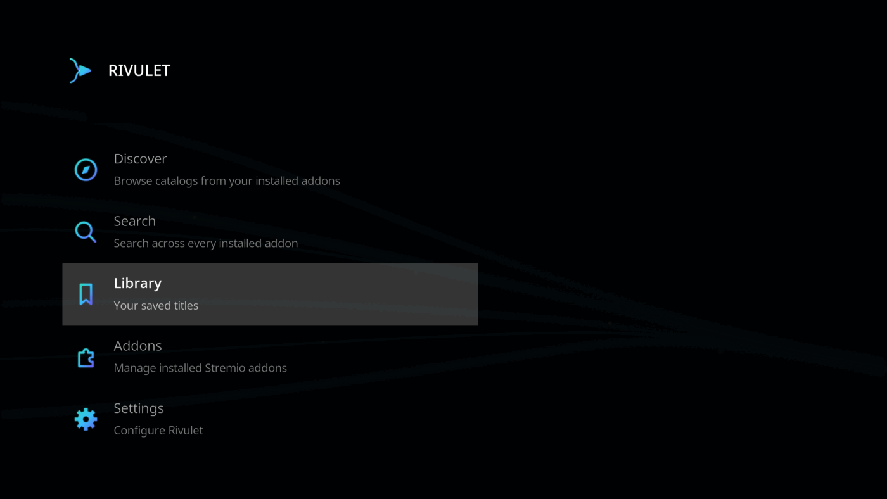
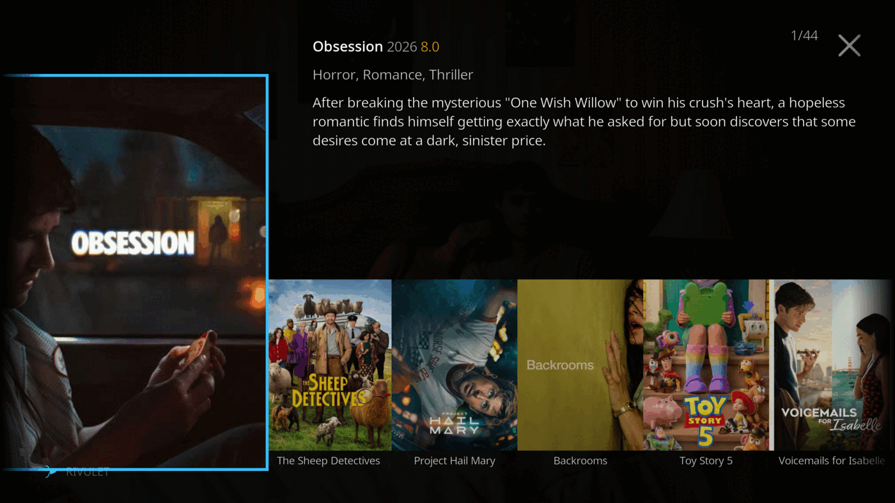
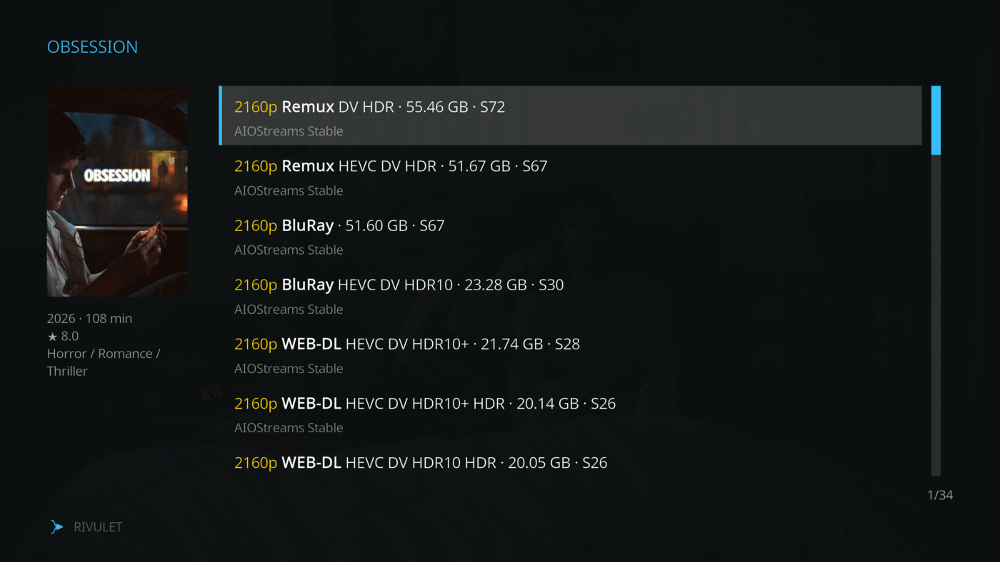
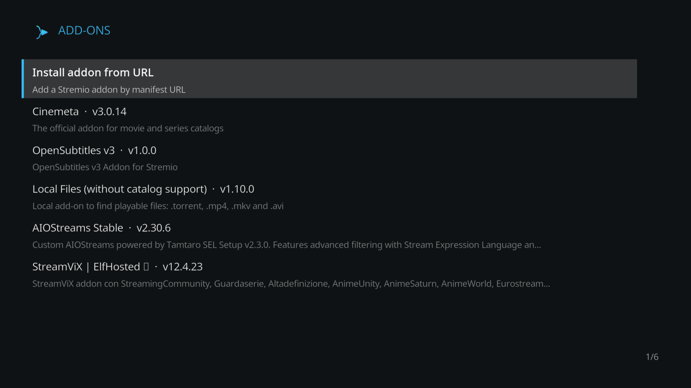
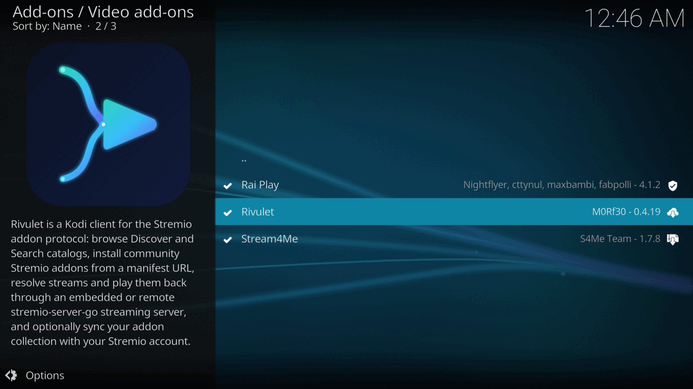
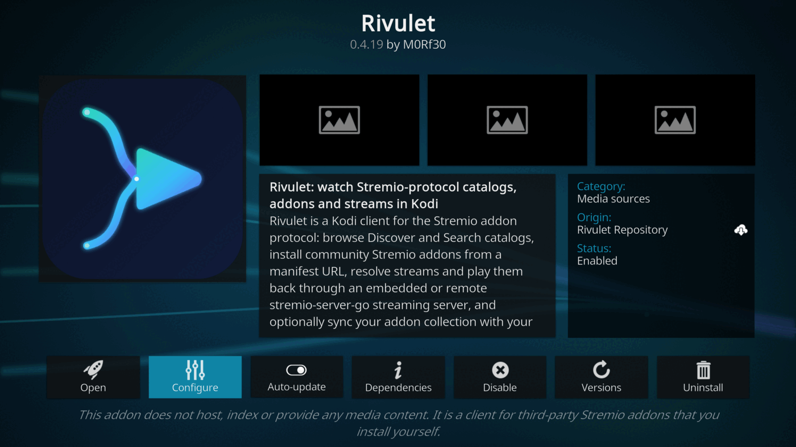

<div align="center">
  

  # Rivulet

  **A Kodi client for the Stremio addon protocol.**

  Discover/Search catalogs, install community addons, resolve streams and
  play them back through a streaming server — all from a custom Kodi UI.

  [](https://github.com/rivulet-kodi/plugin.video.rivulet/actions/workflows/test.yml)
  [](https://github.com/rivulet-kodi/plugin.video.rivulet/actions/workflows/build.yml)
  [](https://github.com/rivulet-kodi/plugin.video.rivulet/releases)
  [](addon.xml)
  [](.github/workflows/test.yml)
  [](pyproject.toml)
</div>

---

Rivulet reimplements the [Stremio](https://www.stremio.com/) client
experience inside Kodi: Discover/Search catalogs from the Stremio addon
protocol, addon management (install from manifest URL), meta/stream
resolution, and playback through a
[stremio-server-go](https://github.com/M0Rf30/stremio-server-go) streaming
server. Optional login syncs your addon collection with your Stremio
account.

> **Disclaimer.** This addon does not host, index or provide any media
> content — it is a client for third-party Stremio addons that you install
> yourself.

## Contents

- [Features](#features)
- [Screenshots](#screenshots)
- [Install](#install)
- [Auto-updates](#auto-updates)
- [Streaming server](#streaming-server)
- [Development](#development)

## Features

- **Custom Home/Discover/Search/Detail/Streams UI** — no dropping to the
  classic Kodi directory for the parts of the flow that matter most.
- **Addon manager** — install Stremio addons straight from a manifest URL,
  and remove them again, without leaving Kodi.
- **Parallel catalog/stream lookups** — a slow or unavailable addon no
  longer stalls the rest of your catalogs or sources.
- **Stremio account sync** — log in to keep your addon collection in sync
  both ways between Kodi and Stremio.
- **Subtitles out of the box** — pulled from your installed Stremio
  subtitle addons at playback time, with OpenSubtitles v3 preinstalled and
  sorted by your preferred language.
- **One-click streaming server** — download the right
  `stremio-server-go` build for your platform and run it embedded, or
  point Rivulet at any server you already run.

## Screenshots

Rivulet's custom UI:

|  |  |
| :---: | :---: |
| **Home** | **Discover** |

|  |  |
| :---: | :---: |
| **Detail + streams** | **Addon manager** |

In Kodi's native UI:

|  |  |
| :---: | :---: |
| **Add-ons browser** | **Add-on info** |

## Install

1. Grab `plugin.video.rivulet-<version>.zip` from a
   [release](https://github.com/rivulet-kodi/plugin.video.rivulet/releases/latest) or from
   the "Build addon zip" GitHub Actions artifact.
2. In Kodi: **Settings → Add-ons → Install from zip file** and pick the
   downloaded zip.
3. Open **Rivulet** from the Videos section of the home screen.

## Auto-updates

Instead of re-downloading and reinstalling a zip for every release, install
the repository once — no separate download needed, useful on set-top boxes
(e.g. Nvidia Shield):

1. **Settings → File manager → Add source**, enter
   `https://rivulet-kodi.github.io/plugin.video.rivulet/` as the path, and
   give it a name (e.g. `Rivulet`).
2. **Settings → Add-ons → Install from zip file → Rivulet →
   repository.rivulet → repository.rivulet-<version>.zip**.
3. From then on, Kodi offers Rivulet — and its future updates — from
   **Settings → Add-ons → Install from repository → Rivulet Repository**,
   with automatic update checks like any other Kodi repo.

Alternatively, grab `repository.rivulet-<version>.zip` from a
[release](https://github.com/rivulet-kodi/plugin.video.rivulet/releases/latest)
or from the "Build addon zip" GitHub Actions artifact, and install it the
same way as step 2 above (**Install from zip file**) without adding a
source.

The repository is served from GitHub Pages at
[rivulet-kodi.github.io/plugin.video.rivulet](https://rivulet-kodi.github.io/plugin.video.rivulet/),
published by `.github/workflows/repo.yml` on every `v*` tag push.

## Streaming server

All playback is resolved through a streaming server speaking the same
`enginefs` HTTP API as Stremio's own `server.js`
([stremio-server-go](https://github.com/M0Rf30/stremio-server-go) is a
pure-Go, drop-in implementation of it). Configure it under
**Settings → Streaming server**:

| Setting | Purpose |
| --- | --- |
| **Server URL** | Where the streaming server is listening. Defaults to `http://127.0.0.1:11470`, the standard Stremio server port. Point this at any already-running `stremio-server-go` (or official Stremio server) instance, local or remote. |
| **Run embedded server** | When enabled, the addon's background service spawns and supervises a local `stremio-server-go` process for the lifetime of the Kodi session, and stops it on shutdown. |
| **Server binary path** | The `stremio-server-go` executable to run when the embedded server is enabled. Leave empty to auto-detect: the service first looks in `special://profile/addon_data/plugin.video.rivulet/bin/`, then on `PATH`. |

`stremio-server-go` no longer needs to be installed by hand: use the
**Download stremio-server binary** button under
**Settings → Streaming server** to fetch the correct build for your platform
straight from the
[stremio-server-go releases](https://github.com/M0Rf30/stremio-server-go/releases)
into the addon's `bin/` folder — the download is integrity-checked before
install. Subtitles are pulled from your installed Stremio subtitle addons at
playback time — OpenSubtitles v3 is preinstalled — and sorted using the
**Preferred subtitle language** setting under **Settings → Subtitles**.

## Development

`lib/stremio/` and `lib/store.py` are plain Python with no `xbmc*` imports,
so they run and test outside Kodi. Everything Kodi-specific lives in
`lib/ui/`, `lib/service_runner.py`, `default.py` and `service.py`. The
Kodi-facing layer is tested against the shared fake-Kodi modules in
`tests/kodistubs/` (a hermetic, per-test `sys.modules` install/restore of
`xbmc*` stubs), so the whole suite runs with no Kodi runtime and no network.

Set up the dev toolchain and run the tests:

```sh
python -m venv .venv && . .venv/bin/activate
pip install -r requirements-dev.txt

make test        # run the test suite
make cov         # tests + coverage report (gate: >=60%)
make lint        # ruff check
make typecheck   # mypy (pure lib/stremio + lib/store layer)
make check       # lint + typecheck + tests
make random      # tests in randomized order (order-independence)
make parallel    # tests across CPUs (pytest-xdist)
```

Tool config lives in `pyproject.toml`. CI (`.github/workflows/test.yml`)
runs ruff + the test suite with coverage across Python 3.8/3.11/3.13
(Kodi 19 "Matrix" through current), on every push and pull request.

Screenshots in the [Screenshots](#screenshots) section above are generated,
not hand-picked crops - `scripts/capture_screenshots.py` drives a running
`kodi-standalone` instance over its always-on TCP JSON-RPC socket
(`127.0.0.1:9090`, no webserver setup needed), walks every screen listed
there plus Kodi's native Add-ons browser, and writes the curated result to
`artwork/screenshots/`. Re-run it after a UI change to refresh the gallery.

---

<div align="center">
  <sub>Licensed under <a href="addon.xml">MIT</a>. Not affiliated with Stremio.</sub>
</div>
